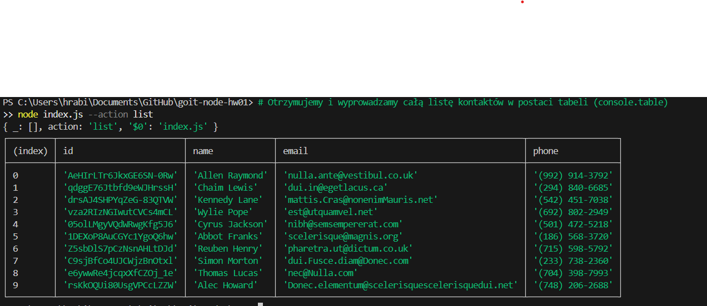
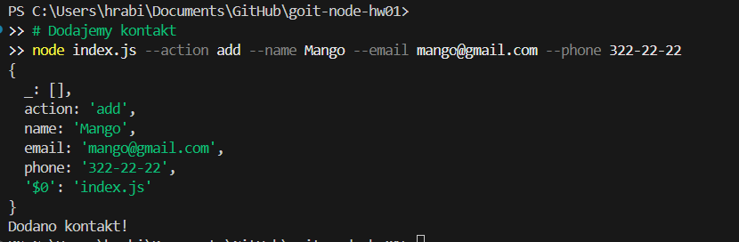

Screeny: 
1. # Otrzymujemy i wyprowadzamy całą listę kontaktów w postaci tabeli (console.table)
node index.js --action list

2. # Otrzymujemy kontakt po id
node index.js --action get --id 05olLMgyVQdWRwgKfg5J6

3. # Dodajemy kontakt
node index.js --action add --name Mango --email mango@gmail.com --phone 322-22-22

4. # Usuwamy kontakt
node index.js --action remove --id qdggE76Jtbfd9eWJHrssH
